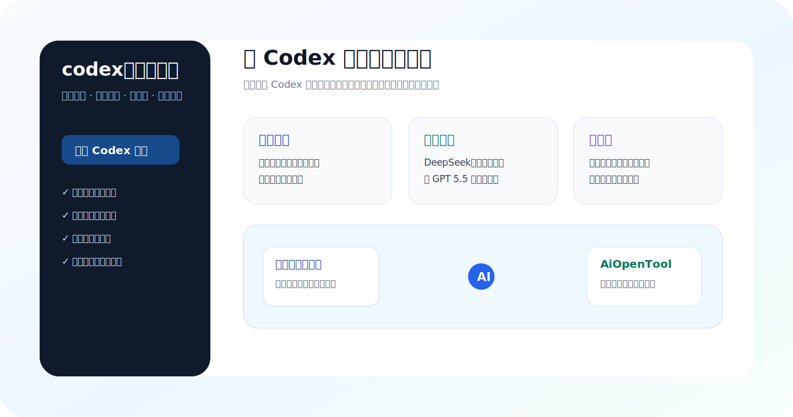

# codex汉化增强版

面向 Windows 桌面 Codex 的本地增强包。它不替代官方 Codex，而是在桌面端补齐中文界面、国产模型接入、多账号切换、新手自动化引导和热更新能力。



## 主要能力

### 中文界面增强

- 覆盖桌面 Codex 常用菜单、设置页、插件页和错误提示。
- 将第三方模型接入、更新状态、服务日志等配置项统一成中文表达。
- 面向普通用户弱化英文技术词，让报错和操作路径更容易理解。

### 多 Codex 账号切换

- 在小白 AI 工具箱中提供“多账号切换”页面。
- 支持查看多个 Codex 原生账号、套餐类型、5 小时额度和周额度。
- 支持切换账号后自动重启桌面 Codex，让桌面端使用目标账号。
- 账号数据保存在桌面 Codex 专用目录，原则上不改 VS Code 的全局配置。

### 国产模型便捷接入

- 支持 DeepSeek、阿里千问、智谱 GLM 等国产模型入口。
- 支持自动拉取服务商可用模型列表，用户优先下拉选择，不需要手动记模型名。
- 支持 API Key 可用性测试、错误原因中文解释和常见解决方式提示。
- 支持 Codex 原生模型、国产模型和 GPT 5.5 类模型之间快速切换。


### 新手自动化引导

- 检测到部署服务器、域名解析、备案、模型开户充值等上下文时，显示轻量引导卡片。
- 可调起小白 AI 工具箱，进入对应页面继续处理。
- 可结合 AiOpenTool 问答站标签推荐已有答案，减少重复问答。
- 引导卡片尽量保持小而弱，不遮挡模型正常回答。

### 自动更新和保底更新

- 正式发布包是预编译产物，用户机器不需要 Node、Go、NSIS 等构建环境。
- 更新服务会定时检查正式发布包，并同步到桌面应用更新通道。
- 桌面端按版本号检查更新，异常时会回退到保底下载地址。

## 适合谁

- 需要中文化桌面 Codex 的用户。
- 想在 Codex 中方便使用 DeepSeek、千问、智谱等国产模型的用户。
- 有多个 Codex 账号，需要查看额度并快速切换的用户。
- 不熟悉服务器、域名、备案、API Key 申请流程的新手用户。

## 发布包说明

GitHub Release 中真正用于热更新的是预编译资产：

```text
codex-plusplus-built-windows-x64-v<version>.tar.gz
codex-plusplus-built-windows-x64-v<version>.tar.gz.sha256
codex-plusplus-built-windows-x64-v<version>.json
```

GitHub 自动生成的 Source code zip/tar.gz 不是用户热更新包，桌面端不会把它当作可用更新。

## 安全边界

- 不代替用户付款、实名、提交备案或执行不可逆云资源操作。
- API Key 和账号相关数据应本地加密保存。
- 桌面 Codex 与 VS Code Codex 插件应保持配置隔离，避免互相影响登录态和沙盒设置。

## 维护方

维护方：AiOpenTool  
站点：https://aiopentool.com/
